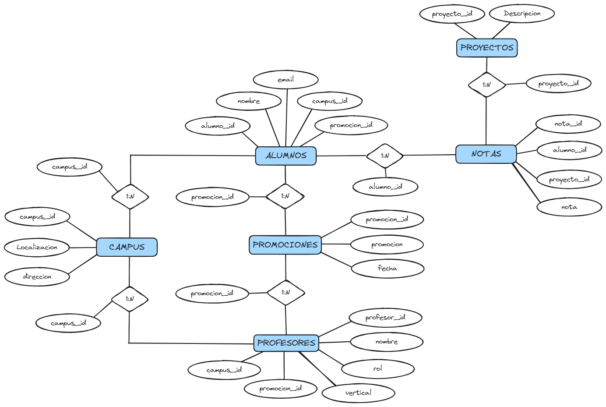
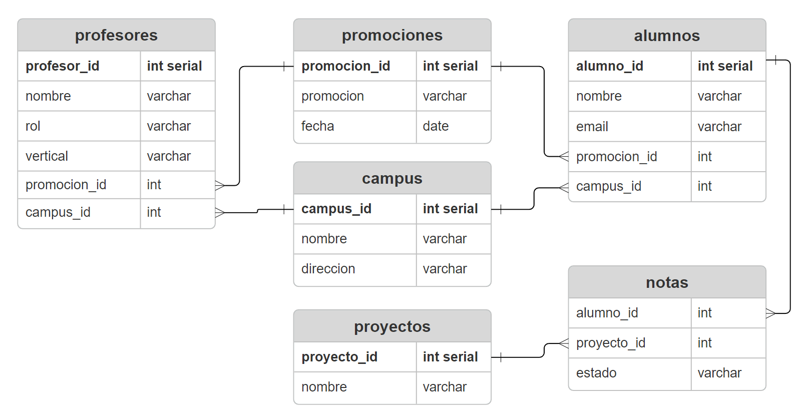

# Proyecto de Base de Datos Relacional
## Descripción del Proyecto
Este proyecto consiste en la creación de una base de datos relacional desde cero para gestionar información de alumnos, profesores, promociones, campus, proyectos y notas de proyectos. La base de datos permitirá almacenar y gestionar datos relacionados con estudiantes, profesores, promociones, campus, proyectos y el progreso de los estudiantes en los proyectos.

## Diagrama Entidad-Relación

## Estructura de la Base de Datos
El proyecto incluye las siguientes tablas en la base de datos:

1. Alumnos

  - Campos: Nombre, Email, Promoción, Campus
2. Profesores

  - Campos: Nombre, Rol, Vertical, Promoción, Campus
3. Promociones

  - Campos: Nombre, Fecha de Comienzo
4. Campus

  - Campos: Nombre, Dirección
5. Proyectos

  - Campos: Nombre del Proyecto
6. NotasProyectos

  - Campos: Alumno_id, Proyecto_id, Estado

## Diagrama de modelo lógico de la base de datos

## Datos de acceso a la DB
- Hostname: flora.db.elephantsql.com
- Port: 5432
- Maintenance database: 	ufdxjqut
- Username: 	ufdxjqut
- Password: _en entregable classrom_

## Autores
- Miguel Ruiz
- Alejandro Sánchez
- Alicia Cortinez
- Diego Nuñez
- Maria Neches
